# Polyglot Codebase Knowledge Graph

> Generated offline by **readmenator**. Supports C, C++, Python, Go, Rust, JS/TS, Java, C#, Shell, PHP, Dart, GDScript, Nim, ASM, Ruby, Swift, Kotlin, Scala, Lua, Elixir.
> No LLMs. No tokens. Pure static analysis. See more [here](https://github.com/grisuno/ReadMenator)

**Total Files Parsed:** 2 | **Total Symbols Extracted:** 46 | **Total Imports:** 11

<!-- ranking_model: v1.0 | weights: {ppr:0.45,auth:0.2,test:0.15,doc:0.1,fresh:0.1} | alpha:0.85 | commit:4c8e0d2 | date:2026-07-18 -->


## Table of Contents

1. [Statistics Dashboard](#statistics-dashboard)
2. [Architectural Layers](#architectural-layers)
3. [Ranked Context](#ranked-context)
4. [God Nodes](#god-nodes)
5. [Suggested Questions](#suggested-questions)
6. [Hotspot Analysis](#hotspot-analysis)
7. [Change Impact Analysis](#change-impact-analysis)
8. [Suggested Linting Rules](#suggested-linting-rules)
9. [Orphans](#orphans)
10. [Query Recipes](#query-recipes)
11. [Structural Knowledge Map](#structural-knowledge-map)
12. [UML Class Diagram](#uml-class-diagram)
13. [Code Property Graph](#code-property-graph)
14. [Architecture Reference](#architecture-reference)
    - [PY (1 files)](#py-1-files)
    - [SH (1 files)](#sh-1-files)

---

## Statistics Dashboard

| Metric | Value |
|--------|-------|
| Total Files | 2 |
| Total Symbols | 46 |
| Total Imports | 11 |
| Call Edges | 322 |
| Inheritance Edges | 2 |
| Languages | 2 |
| Avg Symbols/File | 23.0 |
| Avg Imports/File | 5.5 |

### Top Files by Import Count (Fan-Out)

| File | Imports | Symbols | Language |
|------|---------|---------|----------|
| `app.py` | 11 | 46 | py |

---

## Architectural Layers

Auto-detected from path patterns, naming conventions, and imported frameworks.

| Layer | Files |
|-------|-------|
| utility | 2 |

### utility

- `app.py` (py, 46 symbols)
- `install.sh` (sh, 0 symbols)

---

## Ranked Context

Files ranked by composite score for the current query context. The ranking combines Personalized PageRank (query relevance), global authority, test coverage, documentation coverage, and code freshness. Model: v1.0.

| Rank | File | Composite | PPR | Authority | Test | Doc |
|------|------|-----------|-----|-----------|------|-----|
| 1 | `app.py` | 0.0022 | 0.0000 | 0.0000 | 0.00 | 0.02 |
| 2 | `install.sh` | 0.0000 | 0.0000 | 0.0000 | 0.00 | 0.00 |

---

## God Nodes

Most architecturally central files ranked by combined import/export degree and symbol richness.

| File | Score | Connections | PageRank |
|------|-------|-------------|----------|
| `app.py` | 4.6 | | 0.0000 |
| `install.sh` | 0.0 | | 0.0000 |

---

## Suggested Questions

Auto-generated exploration prompts based on graph structure:

- What does app.py depend on, and what depends on it? (0 connections)
- What does install.sh depend on, and what depends on it? (0 connections)
- What is Config in app.py and how is it used?
- What is the overall architecture of this codebase?

---

## Hotspot Analysis

Files ranked by combined complexity (symbol count) and centrality (connection count). High-scoring files are architecturally critical and may need refactoring attention.

| File | Complexity | Centrality | Combined | Symbols | Connections |
|------|-----------|------------|----------|---------|-------------|
| `app.py` | 1.000 | 1.000 | 1.000 | 46 | 11 |
| `install.sh` | 0.000 | 0.000 | 0.000 | 0 | 0 |

---

## Change Impact Analysis

Files sorted by how many other files would be affected if they changed. High-impact files should be changed with caution.

| File | Direct Dependents | Transitive Dependents | Total Impact |
|------|------------------|----------------------|--------------|
| `app.py` | 0 | 0 | 0 |
| `install.sh` | 0 | 0 | 0 |

---

## Suggested Linting Rules

Automatically suggested linting and security rules based on patterns detected in the codebase. These can be exported as Semgrep rules using the `--export-rules` flag.

| Rule ID | Severity | Description | Language | Matches |
|---------|----------|-------------|----------|---------|
| `RM001` | info | Large number of functions in py: 38 total | py | 38 |
| `RM002` | info | Print statement found (consider logging instead) | python | 61 |

---

## Orphans

Files with no documentation or low connectivity. These are candidates for documentation investment or cleanup.

- `install.sh` (0 symbols, no doc)

---

## Query Recipes

Example queries you can run against this knowledge base using the ranking engine:

```
# Find files most relevant to a concept
readmenator query "Where is the import resolver implemented?"

# Rank files by relevance to a topic
readmenator query "How does documentation generation work?"

# Explain why a file ranks highly
readmenator query "explain readmenator/_documentation.py"

# Trace dependency paths with ranked context
readmenator query "path from CLI to exporter"
```

The ranking model uses the following signals:

- **Personalized PageRank** (45% weight): query-specific relevance via seed propagation
- **Global Authority** (20% weight): structural importance via standard PageRank
- **Test Coverage** (15% weight): fraction of symbols referenced in test files
- **Doc Coverage** (10% weight): presence of docstrings and file-level docs
- **Freshness** (10% weight): recent modification activity

Results include score decomposition and justification paths for each ranked item.

---

## Structural Knowledge Map

```mermaid
graph TD
    classDef mod fill:#1e1e1e,stroke:#ff6666,stroke-width:2px,color:#fff;
    classDef cls fill:#2d2d2d,stroke:#4ec9b0,stroke-width:2px,color:#fff;
    classDef fn fill:#333,stroke:#dcdcaa,stroke-width:1px,color:#dcdcaa;
    classDef ext fill:#111,stroke:#666,stroke-dasharray: 5 5,color:#aaa;
    app_py["app.py (py)"]
    class app_py mod;
    app_py_Config["Config"]
    class app_py_Config cls;
    app_py --> app_py_Config
    app_py_MatrixMultiplicationDataset["MatrixMultiplicationDataset"]
    class app_py_MatrixMultiplicationDataset cls;
    app_py --> app_py_MatrixMultiplicationDataset
    app_py_MLPModel["MLPModel"]
    class app_py_MLPModel cls;
    app_py --> app_py_MLPModel
    app_py_LocalComplexity["LocalComplexity"]
    class app_py_LocalComplexity cls;
    app_py --> app_py_LocalComplexity
    app_py_Superposition["Superposition"]
    class app_py_Superposition cls;
    app_py --> app_py_Superposition
    install_sh["install.sh (sh)"]
    class install_sh mod;
    ext_torch["torch"]
    class ext_torch ext;
    app_py -.->|imports| ext_torch
    ext_torch_nn["torch.nn"]
    class ext_torch_nn ext;
    app_py -.->|imports| ext_torch_nn
    ext_torch_optim["torch.optim"]
    class ext_torch_optim ext;
    app_py -.->|imports| ext_torch_optim
    ext_torch_utils_data["torch.utils.data"]
    class ext_torch_utils_data ext;
    app_py -.->|imports| ext_torch_utils_data
    ext_numpy["numpy"]
    class ext_numpy ext;
    app_py -.->|imports| ext_numpy
    ext_typing["typing"]
    class ext_typing ext;
    app_py -.->|imports| ext_typing
    ext_json["json"]
    class ext_json ext;
    app_py -.->|imports| ext_json
    ext_os["os"]
    class ext_os ext;
    app_py -.->|imports| ext_os
    ext_time["time"]
    class ext_time ext;
    app_py -.->|imports| ext_time
    ext_datetime["datetime"]
    class ext_datetime ext;
    app_py -.->|imports| ext_datetime
    ext_pathlib["pathlib"]
    class ext_pathlib ext;
    app_py -.->|imports| ext_pathlib
```



---

## UML Class Diagram

Auto-generated Mermaid class diagram from parsed class-level symbols. Shows classes, structs, interfaces, traits, and their methods with inheritance and dependency relationships.

```mermaid
classDiagram
  class app_py_Config {
    <<class>>
    +run_full_experiment()
    +resume_from_latest_checkpoint(config)
    +load_specific_checkpoint(checkpoint_path, config)
    +__init__(self)
    +__init__(self, matrix_size, num_samples, random_range, device)
    +_generate_matrices(self, num_samples)
    +_compute_products(self, a, b)
    +__len__(self)
    +__getitem__(self, idx)
    +__init__(self, input_dim, output_dim, hidden_dim, num_layers, activation)
  }
  class app_py_MatrixMultiplicationDataset {
    <<class>>
    +run_full_experiment()
    +resume_from_latest_checkpoint(config)
    +load_specific_checkpoint(checkpoint_path, config)
    +__init__(self)
    +__init__(self, matrix_size, num_samples, random_range, device)
    +_generate_matrices(self, num_samples)
    +_compute_products(self, a, b)
    +__len__(self)
    +__getitem__(self, idx)
    +__init__(self, input_dim, output_dim, hidden_dim, num_layers, activation)
  }
  class app_py_MLPModel {
    <<class>>
    +run_full_experiment()
    +resume_from_latest_checkpoint(config)
    +load_specific_checkpoint(checkpoint_path, config)
    +__init__(self)
    +__init__(self, matrix_size, num_samples, random_range, device)
    +_generate_matrices(self, num_samples)
    +_compute_products(self, a, b)
    +__len__(self)
    +__getitem__(self, idx)
    +__init__(self, input_dim, output_dim, hidden_dim, num_layers, activation)
  }
  class app_py_LocalComplexity {
    <<class>>
    +run_full_experiment()
    +resume_from_latest_checkpoint(config)
    +load_specific_checkpoint(checkpoint_path, config)
    +__init__(self)
    +__init__(self, matrix_size, num_samples, random_range, device)
    +_generate_matrices(self, num_samples)
    +_compute_products(self, a, b)
    +__len__(self)
    +__getitem__(self, idx)
    +__init__(self, input_dim, output_dim, hidden_dim, num_layers, activation)
  }
  class app_py_Superposition {
    <<class>>
    +run_full_experiment()
    +resume_from_latest_checkpoint(config)
    +load_specific_checkpoint(checkpoint_path, config)
    +__init__(self)
    +__init__(self, matrix_size, num_samples, random_range, device)
    +_generate_matrices(self, num_samples)
    +_compute_products(self, a, b)
    +__len__(self)
    +__getitem__(self, idx)
    +__init__(self, input_dim, output_dim, hidden_dim, num_layers, activation)
  }
  class app_py_MetricsTracker {
    <<class>>
    +run_full_experiment()
    +resume_from_latest_checkpoint(config)
    +load_specific_checkpoint(checkpoint_path, config)
    +__init__(self)
    +__init__(self, matrix_size, num_samples, random_range, device)
    +_generate_matrices(self, num_samples)
    +_compute_products(self, a, b)
    +__len__(self)
    +__getitem__(self, idx)
    +__init__(self, input_dim, output_dim, hidden_dim, num_layers, activation)
  }
  class app_py_ThermalEngine {
    <<class>>
    +run_full_experiment()
    +resume_from_latest_checkpoint(config)
    +load_specific_checkpoint(checkpoint_path, config)
    +__init__(self)
    +__init__(self, matrix_size, num_samples, random_range, device)
    +_generate_matrices(self, num_samples)
    +_compute_products(self, a, b)
    +__len__(self)
    +__getitem__(self, idx)
    +__init__(self, input_dim, output_dim, hidden_dim, num_layers, activation)
  }
  class app_py_MatrixGrokker {
    <<class>>
    +run_full_experiment()
    +resume_from_latest_checkpoint(config)
    +load_specific_checkpoint(checkpoint_path, config)
    +__init__(self)
    +__init__(self, matrix_size, num_samples, random_range, device)
    +_generate_matrices(self, num_samples)
    +_compute_products(self, a, b)
    +__len__(self)
    +__getitem__(self, idx)
    +__init__(self, input_dim, output_dim, hidden_dim, num_layers, activation)
  }
```



---

## Code Property Graph

Machine-readable Code Property Graph (CPG) in JSON-LD format. This block allows AI agents to parse the full structural graph without additional file reads. Compatible with GraphRAG pipelines.

```json
{"@context": "https://schema.org", "analysis": {"communities": [], "god_nodes": [{"node_id": "app.py", "score": 4.6}, {"node_id": "install.sh", "score": 0.0}], "surprising_connections": []}, "edges": [{"confidence": "EXTRACTED", "relation": "imports", "source": "app.py", "target": "torch"}, {"confidence": "EXTRACTED", "relation": "imports", "source": "app.py", "target": "torch.nn"}, {"confidence": "EXTRACTED", "relation": "imports", "source": "app.py", "target": "torch.optim"}, {"confidence": "EXTRACTED", "relation": "imports", "source": "app.py", "target": "torch.utils.data"}, {"confidence": "EXTRACTED", "relation": "imports", "source": "app.py", "target": "numpy"}, {"confidence": "EXTRACTED", "relation": "imports", "source": "app.py", "target": "typing"}, {"confidence": "EXTRACTED", "relation": "imports", "source": "app.py", "target": "json"}, {"confidence": "EXTRACTED", "relation": "imports", "source": "app.py", "target": "os"}, {"confidence": "EXTRACTED", "relation": "imports", "source": "app.py", "target": "time"}, {"confidence": "EXTRACTED", "relation": "imports", "source": "app.py", "target": "datetime"}, {"confidence": "EXTRACTED", "relation": "imports", "source": "app.py", "target": "pathlib"}], "generator": "readmenator", "metadata": {"edge_count": 335, "file_count": 2, "language_count": 2, "symbol_count": 46}, "nodes": [{"doc": "_*_ coding: utf8 _*_", "id": "app.py", "kind": "module", "label": "app.py", "language": "py", "sha256": "494803caeab9fa75", "symbol_count": 46, "symbols": [{"kind": "class", "line": 26, "name": "Config", "signature": "class Config"}, {"kind": "class", "line": 58, "name": "MatrixMultiplicationDataset", "signature": "class MatrixMultiplicationDataset(Dataset)"}, {"kind": "class", "line": 88, "name": "MLPModel", "signature": "class MLPModel(Module)"}, {"kind": "class", "line": 183, "name": "LocalComplexity", "signature": "class LocalComplexity"}, {"kind": "class", "line": 230, "name": "Superposition", "signature": "class Superposition"}, {"kind": "class", "line": 257, "name": "MetricsTracker", "signature": "class MetricsTracker"}, {"kind": "class", "line": 325, "name": "ThermalEngine", "signature": "class ThermalEngine"}, {"kind": "class", "line": 355, "name": "MatrixGrokker", "signature": "class MatrixGrokker"}, {"kind": "method", "line": 708, "name": "run_full_experiment", "signature": "def run_full_experiment()"}, {"kind": "method", "line": 753, "name": "resume_from_latest_checkpoint", "signature": "def resume_from_latest_checkpoint(config)"}, {"kind": "method", "line": 770, "name": "load_specific_checkpoint", "signature": "def load_specific_checkpoint(checkpoint_path, config)"}, {"kind": "method", "line": 27, "name": "__init__", "signature": "def __init__(self)"}, {"kind": "method", "line": 59, "name": "__init__", "signature": "def __init__(self, matrix_size, num_samples, random_range, device)"}, {"kind": "method", "line": 73, "name": "_generate_matrices", "signature": "def _generate_matrices(self, num_samples)"}, {"kind": "method", "line": 78, "name": "_compute_products", "signature": "def _compute_products(self, a, b)"}, {"kind": "method", "line": 81, "name": "__len__", "signature": "def __len__(self)"}, {"kind": "method", "line": 84, "name": "__getitem__", "signature": "def __getitem__(self, idx)"}, {"kind": "method", "line": 89, "name": "__init__", "signature": "def __init__(self, input_dim, output_dim, hidden_dim, num_layers, activation)"}, {"kind": "method", "line": 115, "name": "forward", "signature": "def forward(self, x)"}, {"kind": "method", "line": 121, "name": "get_weight_matrix", "signature": "def get_weight_matrix(self)"}, {"kind": "method", "line": 128, "name": "expand_weights", "signature": "def expand_weights(self, new_hidden_dim)"}, {"kind": "method", "line": 155, "name": "expand_for_new_task", "signature": "def expand_for_new_task(self, new_input_dim, new_output_dim, new_hidden_dim)"}, {"kind": "method", "line": 185, "name": "compute", "signature": "def compute(activations, epsilon)"}, {"kind": "method", "line": 205, "name": "from_model", "signature": "def from_model(model, x)"}, {"kind": "method", "line": 232, "name": "compute", "signature": "def compute(weights, rank, epsilon)"}, {"kind": "method", "line": 252, "name": "from_model", "signature": "def from_model(model, rank)"}, {"kind": "method", "line": 258, "name": "__init__", "signature": "def __init__(self)"}, {"kind": "method", "line": 273, "name": "start_epoch", "signature": "def start_epoch(self)"}, {"kind": "method", "line": 277, "name": "log_iteration", "signature": "def log_iteration(self, iteration_time)"}, {"kind": "method", "line": 280, "name": "end_epoch", "signature": "def end_epoch(self)"}, {"kind": "method", "line": 287, "name": "compute_ips", "signature": "def compute_ips(self)"}, {"kind": "method", "line": 293, "name": "log_metrics", "signature": "def log_metrics(self, train_loss, val_loss, train_acc, val_acc, lc, sp, lr, wd)"}, {"kind": "method", "line": 305, "name": "get_summary", "signature": "def get_summary(self)"}, {"kind": "method", "line": 326, "name": "__init__", "signature": "def __init__(self, config)"}, {"kind": "method", "line": 334, "name": "compute_weight_decay", "signature": "def compute_weight_decay(self, lc, sp, epoch)"}, {"kind": "method", "line": 348, "name": "get_status", "signature": "def get_status(self, lc, sp)"}, {"kind": "method", "line": 356, "name": "__init__", "signature": "def __init__(self, config)"}, {"kind": "method", "line": 396, "name": "find_latest_checkpoint", "signature": "def find_latest_checkpoint(self)"}, {"kind": "method", "line": 407, "name": "load_checkpoint", "signature": "def load_checkpoint(self, checkpoint_path)"}, {"kind": "method", "line": 446, "name": "_create_model", "signature": "def _create_model(self)"}, {"kind": "method", "line": 455, "name": "_create_datasets", "signature": "def _create_datasets(self)"}, {"kind": "method", "line": 474, "name": "_compute_accuracy", "signature": "def _compute_accuracy(self, predictions, targets, threshold)"}, {"kind": "method", "line": 479, "name": "train", "signature": "def train(self, resume_from_checkpoint)"}, {"kind": "method", "line": 608, "name": "_save_checkpoint", "signature": "def _save_checkpoint(self, model, optimizer, epoch, ips)"}, {"kind": "method", "line": 640, "name": "zero_shot_transfer", "signature": "def zero_shot_transfer(self, target_matrix_size)"}, {"kind": "method", "line": 208, "name": "hook", "signature": "def hook(module, input, output)"}]}, {"id": "install.sh", "kind": "module", "label": "install.sh", "language": "sh", "sha256": "c907d80fd6734993", "symbol_count": 0, "symbols": []}], "type": "CodePropertyGraph", "version": "1.0"}
```

---

## Architecture Reference

### PY (1 files)

#### `app.py`
**Path:** `app.py`
**File Doc:** *_*_ coding: utf8 _*_*

**Classes:**
- `Config` (line 26) `class Config`
- `MatrixMultiplicationDataset` (line 58) `class MatrixMultiplicationDataset(Dataset)`
- `MLPModel` (line 88) `class MLPModel(Module)`
- `LocalComplexity` (line 183) `class LocalComplexity`
- `Superposition` (line 230) `class Superposition`
- `MetricsTracker` (line 257) `class MetricsTracker`
- `ThermalEngine` (line 325) `class ThermalEngine`
- `MatrixGrokker` (line 355) `class MatrixGrokker`

**Methods:**
- `run_full_experiment` (line 708) `def run_full_experiment()`
- `resume_from_latest_checkpoint` (line 753) `def resume_from_latest_checkpoint(config)`
- `load_specific_checkpoint` (line 770) `def load_specific_checkpoint(checkpoint_path, config)`
- `__init__` (line 27) `def __init__(self)`
- `__init__` (line 59) `def __init__(self, matrix_size, num_samples, random_range, device)`
- `_generate_matrices` (line 73) `def _generate_matrices(self, num_samples)`
- `_compute_products` (line 78) `def _compute_products(self, a, b)`
- `__len__` (line 81) `def __len__(self)`
- `__getitem__` (line 84) `def __getitem__(self, idx)`
- `__init__` (line 89) `def __init__(self, input_dim, output_dim, hidden_dim, num_layers, activation)`
- `forward` (line 115) `def forward(self, x)`
- `get_weight_matrix` (line 121) `def get_weight_matrix(self)`
- `expand_weights` (line 128) `def expand_weights(self, new_hidden_dim)`
- `expand_for_new_task` (line 155) `def expand_for_new_task(self, new_input_dim, new_output_dim, new_hidden_dim)`
- `compute` (line 185) `def compute(activations, epsilon)`
- `from_model` (line 205) `def from_model(model, x)`
- `compute` (line 232) `def compute(weights, rank, epsilon)`
- `from_model` (line 252) `def from_model(model, rank)`
- `__init__` (line 258) `def __init__(self)`
- `start_epoch` (line 273) `def start_epoch(self)`
- `log_iteration` (line 277) `def log_iteration(self, iteration_time)`
- `end_epoch` (line 280) `def end_epoch(self)`
- `compute_ips` (line 287) `def compute_ips(self)`
- `log_metrics` (line 293) `def log_metrics(self, train_loss, val_loss, train_acc, val_acc, lc, sp, lr, wd)`
- `get_summary` (line 305) `def get_summary(self)`
- `__init__` (line 326) `def __init__(self, config)`
- `compute_weight_decay` (line 334) `def compute_weight_decay(self, lc, sp, epoch)`
- `get_status` (line 348) `def get_status(self, lc, sp)`
- `__init__` (line 356) `def __init__(self, config)`
- `find_latest_checkpoint` (line 396) `def find_latest_checkpoint(self)`
- `load_checkpoint` (line 407) `def load_checkpoint(self, checkpoint_path)`
- `_create_model` (line 446) `def _create_model(self)`
- `_create_datasets` (line 455) `def _create_datasets(self)`
- `_compute_accuracy` (line 474) `def _compute_accuracy(self, predictions, targets, threshold)`
- `train` (line 479) `def train(self, resume_from_checkpoint)`
- `_save_checkpoint` (line 608) `def _save_checkpoint(self, model, optimizer, epoch, ips)`
- `zero_shot_transfer` (line 640) `def zero_shot_transfer(self, target_matrix_size)`
- `hook` (line 208) `def hook(module, input, output)`

### SH (1 files)

#### `install.sh`
**Path:** `install.sh`

*No symbols extracted*
