# Polyglot Codebase Knowledge Graph

> Generated offline by **readmenator**. Supports C, C++, Python, Go, Rust, JS/TS, Java, C#, Shell, PHP, Dart, GDScript, Nim, ASM.
> No LLMs. No tokens. Pure static analysis.

**Total Files Parsed:** 2 | **Total Symbols Extracted:** 46 | **Total Imports:** 11

## Structural Knowledge Map

```mermaid
graph TD
    classDef mod fill:#1e1e1e,stroke:#ff6666,stroke-width:2px,color:#fff;
    classDef cls fill:#2d2d2d,stroke:#4ec9b0,stroke-width:2px,color:#fff;
    classDef fn fill:#333,stroke:#dcdcaa,stroke-width:1px,color:#dcdcaa;
    classDef ext fill:#111,stroke:#666,stroke-dasharray: 5 5,color:#aaa;
    app_py["app.py (py)"]
    class app_py mod;
    app_py_Config["Config"]
    class app_py_Config cls;
    app_py --> app_py_Config
    app_py_MatrixMultiplicationDataset["MatrixMultiplicationDataset"]
    class app_py_MatrixMultiplicationDataset cls;
    app_py --> app_py_MatrixMultiplicationDataset
    app_py_MLPModel["MLPModel"]
    class app_py_MLPModel cls;
    app_py --> app_py_MLPModel
    app_py_LocalComplexity["LocalComplexity"]
    class app_py_LocalComplexity cls;
    app_py --> app_py_LocalComplexity
    app_py_Superposition["Superposition"]
    class app_py_Superposition cls;
    app_py --> app_py_Superposition
    install_sh["install.sh (sh)"]
    class install_sh mod;
    ext_torch["torch"]
    class ext_torch ext;
    app_py -.->|imports| ext_torch
    ext_torch_nn["torch.nn"]
    class ext_torch_nn ext;
    app_py -.->|imports| ext_torch_nn
    ext_torch_optim["torch.optim"]
    class ext_torch_optim ext;
    app_py -.->|imports| ext_torch_optim
    ext_torch_utils_data["torch.utils.data"]
    class ext_torch_utils_data ext;
    app_py -.->|imports| ext_torch_utils_data
    ext_numpy["numpy"]
    class ext_numpy ext;
    app_py -.->|imports| ext_numpy
    ext_typing["typing"]
    class ext_typing ext;
    app_py -.->|imports| ext_typing
    ext_json["json"]
    class ext_json ext;
    app_py -.->|imports| ext_json
    ext_os["os"]
    class ext_os ext;
    app_py -.->|imports| ext_os
    ext_time["time"]
    class ext_time ext;
    app_py -.->|imports| ext_time
    ext_datetime["datetime"]
    class ext_datetime ext;
    app_py -.->|imports| ext_datetime
    ext_pathlib["pathlib"]
    class ext_pathlib ext;
    app_py -.->|imports| ext_pathlib
```

---

## Architecture Reference

### PY (1 files)

#### `app.py`
**Path:** `app.py`

**Classs:**
- `Config` (line 26)
- `MatrixMultiplicationDataset` (line 58)
- `MLPModel` (line 88)
- `LocalComplexity` (line 183)
- `Superposition` (line 230)
- `MetricsTracker` (line 257)
- `ThermalEngine` (line 325)
- `MatrixGrokker` (line 355)

**Functions:**
- `run_full_experiment` (line 708)
- `resume_from_latest_checkpoint` (line 753)
- `load_specific_checkpoint` (line 770)
- `__init__` (line 27)
- `__init__` (line 59)
- `_generate_matrices` (line 73)
- `_compute_products` (line 78)
- `__len__` (line 81)
- `__getitem__` (line 84)
- `__init__` (line 89)
- `forward` (line 115)
- `get_weight_matrix` (line 121)
- `expand_weights` (line 128)
- `expand_for_new_task` (line 155)
- `compute` (line 185)
- `from_model` (line 205)
- `compute` (line 232)
- `from_model` (line 252)
- `__init__` (line 258)
- `start_epoch` (line 273)
- `log_iteration` (line 277)
- `end_epoch` (line 280)
- `compute_ips` (line 287)
- `log_metrics` (line 293)
- `get_summary` (line 305)
- `__init__` (line 326)
- `compute_weight_decay` (line 334)
- `get_status` (line 348)
- `__init__` (line 356)
- `find_latest_checkpoint` (line 396)
- `load_checkpoint` (line 407)
- `_create_model` (line 446)
- `_create_datasets` (line 455)
- `_compute_accuracy` (line 474)
- `train` (line 479)
- `_save_checkpoint` (line 608)
- `zero_shot_transfer` (line 640)
- `hook` (line 208)

### SH (1 files)

#### `install.sh`
**Path:** `install.sh`

*No symbols extracted*
