# Polyglot Codebase Knowledge Graph

> Generated offline by **readmenator**. Supports C, C++, Python, Go, Rust, JS/TS, Java, C#, Shell, PHP, Dart, GDScript, Nim, ASM.
> No LLMs. No tokens. Pure static analysis. See more [here](https://github.com/grisuno/ReadMenator)

**Total Files Parsed:** 2 | **Total Symbols Extracted:** 46 | **Total Imports:** 11

## Structural Knowledge Map

```mermaid
graph TD
    classDef mod fill:#1e1e1e,stroke:#ff6666,stroke-width:2px,color:#fff;
    classDef cls fill:#2d2d2d,stroke:#4ec9b0,stroke-width:2px,color:#fff;
    classDef fn fill:#333,stroke:#dcdcaa,stroke-width:1px,color:#dcdcaa;
    classDef ext fill:#111,stroke:#666,stroke-dasharray: 5 5,color:#aaa;
    app_py["app.py (py)"]
    class app_py mod;
    app_py_Config["Config"]
    class app_py_Config cls;
    app_py --> app_py_Config
    app_py_MatrixMultiplicationDataset["MatrixMultiplicationDataset"]
    class app_py_MatrixMultiplicationDataset cls;
    app_py --> app_py_MatrixMultiplicationDataset
    app_py_MLPModel["MLPModel"]
    class app_py_MLPModel cls;
    app_py --> app_py_MLPModel
    app_py_LocalComplexity["LocalComplexity"]
    class app_py_LocalComplexity cls;
    app_py --> app_py_LocalComplexity
    app_py_Superposition["Superposition"]
    class app_py_Superposition cls;
    app_py --> app_py_Superposition
    install_sh["install.sh (sh)"]
    class install_sh mod;
    ext_torch["torch"]
    class ext_torch ext;
    app_py -.->|imports| ext_torch
    ext_torch_nn["torch.nn"]
    class ext_torch_nn ext;
    app_py -.->|imports| ext_torch_nn
    ext_torch_optim["torch.optim"]
    class ext_torch_optim ext;
    app_py -.->|imports| ext_torch_optim
    ext_torch_utils_data["torch.utils.data"]
    class ext_torch_utils_data ext;
    app_py -.->|imports| ext_torch_utils_data
    ext_numpy["numpy"]
    class ext_numpy ext;
    app_py -.->|imports| ext_numpy
    ext_typing["typing"]
    class ext_typing ext;
    app_py -.->|imports| ext_typing
    ext_json["json"]
    class ext_json ext;
    app_py -.->|imports| ext_json
    ext_os["os"]
    class ext_os ext;
    app_py -.->|imports| ext_os
    ext_time["time"]
    class ext_time ext;
    app_py -.->|imports| ext_time
    ext_datetime["datetime"]
    class ext_datetime ext;
    app_py -.->|imports| ext_datetime
    ext_pathlib["pathlib"]
    class ext_pathlib ext;
    app_py -.->|imports| ext_pathlib
```

---

## Architecture Reference

### PY (1 files)

#### `app.py`
**Path:** `app.py`

**Classes:**
- `Config` (line 26) `class Config`
- `MatrixMultiplicationDataset` (line 58) `class MatrixMultiplicationDataset(Dataset)`
- `MLPModel` (line 88) `class MLPModel`
- `LocalComplexity` (line 183) `class LocalComplexity`
- `Superposition` (line 230) `class Superposition`
- `MetricsTracker` (line 257) `class MetricsTracker`
- `ThermalEngine` (line 325) `class ThermalEngine`
- `MatrixGrokker` (line 355) `class MatrixGrokker`

**Functions:**
- `run_full_experiment` (line 708) `def run_full_experiment()`
- `resume_from_latest_checkpoint` (line 753) `def resume_from_latest_checkpoint(config)`
- `load_specific_checkpoint` (line 770) `def load_specific_checkpoint(checkpoint_path, config)`
- `__init__` (line 27) `def __init__(self)`
- `__init__` (line 59) `def __init__(self, matrix_size, num_samples, random_range, device)`
- `_generate_matrices` (line 73) `def _generate_matrices(self, num_samples)`
- `_compute_products` (line 78) `def _compute_products(self, a, b)`
- `__len__` (line 81) `def __len__(self)`
- `__getitem__` (line 84) `def __getitem__(self, idx)`
- `__init__` (line 89) `def __init__(self, input_dim, output_dim, hidden_dim, num_layers, activation)`
- `forward` (line 115) `def forward(self, x)`
- `get_weight_matrix` (line 121) `def get_weight_matrix(self)`
- `expand_weights` (line 128) `def expand_weights(self, new_hidden_dim)`
- `expand_for_new_task` (line 155) `def expand_for_new_task(self, new_input_dim, new_output_dim, new_hidden_dim)`
- `compute` (line 185) `def compute(activations, epsilon)`
- `from_model` (line 205) `def from_model(model, x)`
- `compute` (line 232) `def compute(weights, rank, epsilon)`
- `from_model` (line 252) `def from_model(model, rank)`
- `__init__` (line 258) `def __init__(self)`
- `start_epoch` (line 273) `def start_epoch(self)`
- `log_iteration` (line 277) `def log_iteration(self, iteration_time)`
- `end_epoch` (line 280) `def end_epoch(self)`
- `compute_ips` (line 287) `def compute_ips(self)`
- `log_metrics` (line 293) `def log_metrics(self, train_loss, val_loss, train_acc, val_acc, lc, sp, lr, wd)`
- `get_summary` (line 305) `def get_summary(self)`
- `__init__` (line 326) `def __init__(self, config)`
- `compute_weight_decay` (line 334) `def compute_weight_decay(self, lc, sp, epoch)`
- `get_status` (line 348) `def get_status(self, lc, sp)`
- `__init__` (line 356) `def __init__(self, config)`
- `find_latest_checkpoint` (line 396) `def find_latest_checkpoint(self)`
- `load_checkpoint` (line 407) `def load_checkpoint(self, checkpoint_path)`
- `_create_model` (line 446) `def _create_model(self)`
- `_create_datasets` (line 455) `def _create_datasets(self)`
- `_compute_accuracy` (line 474) `def _compute_accuracy(self, predictions, targets, threshold)`
- `train` (line 479) `def train(self, resume_from_checkpoint)`
- `_save_checkpoint` (line 608) `def _save_checkpoint(self, model, optimizer, epoch, ips)`
- `zero_shot_transfer` (line 640) `def zero_shot_transfer(self, target_matrix_size)`
- `hook` (line 208) `def hook(module, input, output)`

### SH (1 files)

#### `install.sh`
**Path:** `install.sh`

*No symbols extracted*
